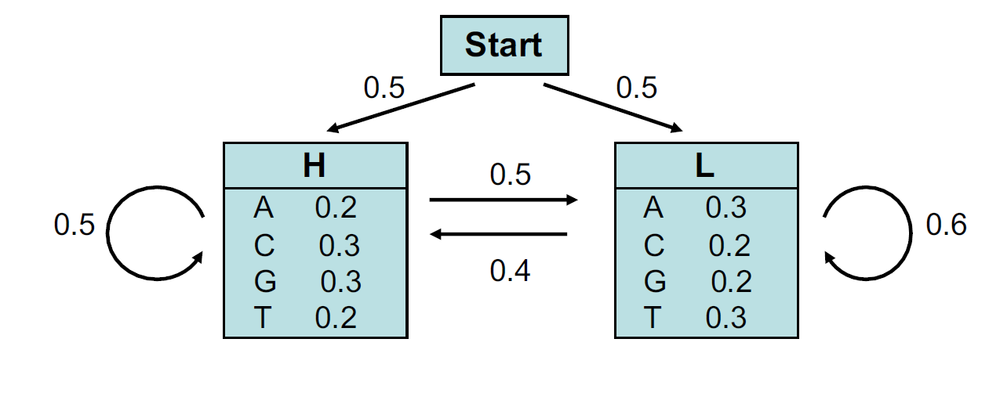
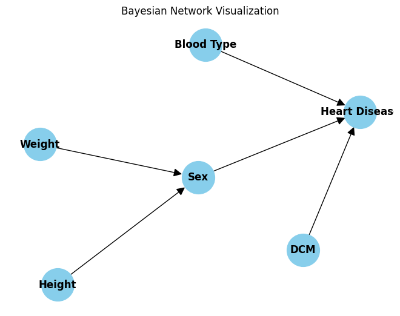

# Heart Disease Prediction from DNA (HMM + Bayesian Network)

A clean, self-contained notebook that predicts **heart-disease risk** from DNA sequences using a two-stage probabilistic pipeline:

1) **Hidden Markov Model (HMM):** decodes each DNA string into **High/Low GC** regions via **Viterbi** and estimates sequence likelihood via the **Forward** algorithm.  
2) **Bayesian Inference:** converts the H/L sequence into probabilities for **height, weight, blood type, DCM**, and **sex**, then combines them in a **Bayesian Network** to obtain the final **heart-disease probability**.

<p align="center">
  <em>Python • NumPy • Pandas • Probabilistic Modeling (HMM & BN)</em>
</p>

---

## What this repo demonstrates

- **From-scratch HMM** implementation (states, emissions, start/transition matrices) with:
  - Viterbi decoding of GC-content states `H`/`L`
  - Forward algorithm for sequence likelihood/posteriors
- **Feature inference from H/L** via tailored emission/transition/start priors
- **Bayesian Network** over {Sex, Height, Weight, Blood Type, DCM → Heart Disease}
- **Deterministic classification** (`Label=1` if P(HeartDisease)=P(Y) > 0.5) and CSV export

---

## Repository Structure

```

Heart-Disease-Prediction/
├─ AI\_HMM\_BN.ipynb               # Main notebook (HMM & BN pipeline)
├─ DNA\_patients.csv              # Input (ID, DNA)
├─ heart\_disease\_result.csv      # Output (ID, Label) produced by the notebook
├─ BN.png                        # Bayesian network diagram (used in notebook/README)
└─ Probabilities.png             # HMM start/transition/emission illustration

```

**Figures**

- HMM start/transition/emission schema  
  
- Bayesian network used for final inference  
  

---

## Data

- **Input:** `DNA_patients.csv` with two columns:
  - `ID` — integer patient identifier
  - `DNA` — string over `{A,C,G,T}`  
- **Output:** `heart_disease_result.csv` with:
  - `ID` — copied from input
  - `Label` — `1` if predicted P(Heart Disease=Y) > 0.5, else `0`

Example output rows (preview):

```

867,1
868,1
869,0
870,1
871,1

````

---

## How it works (method at a glance)

1. **HMM over nucleotides (A,C,G,T)**
   - States: `H` (high GC), `L` (low GC)  
   - Start: `[0.5, 0.5]`  
   - Transition: `[[0.5, 0.5],[0.4, 0.6]]`  
   - Emissions:  
     - `H: {A:0.2, C:0.3, G:0.3, T:0.2}`  
     - `L: {A:0.3, C:0.2, G:0.2, T:0.3}`
   - **Viterbi** decodes the most likely H/L path for each DNA.

2. **Mapping H/L to individual features**
   - Uses small HMMs / priors to compute posteriors for:
     - **Height** ∈ {160,170,180,190}
     - **Weight** ∈ {50,65,80,95}
     - **Blood Type** ∈ {O,A,B,AB}
     - **DCM** ∈ {Y,N}
   - **Sex** is inferred via `P(sex | height, weight)`.

3. **Bayesian Network inference**
   - Final probability: `P(HeartDisease | Sex, BloodType, DCM)` via a conditional table.
   - **Decision rule:** assign `1` if `P(HeartDisease=Y) > 0.5`, else `0`.

> This is a research/educational pipeline illustrating probabilistic modeling—not a clinical tool.

---

## Requirements

- Python **3.8+**
- `numpy`, `pandas`, `jupyter` (optional: run in Google Colab)

Install locally:
```bash
python -m venv .venv
source .venv/bin/activate        # Windows: .venv\Scripts\activate
pip install numpy pandas jupyter
````

---

## Reproducibility (Run End-to-End)

1. Place `DNA_patients.csv` in the project root.
2. Open the notebook:

   ```bash
   jupyter notebook AI_HMM_BN.ipynb
   ```

   or upload it to Google Colab.
3. **Run all cells**.
4. The notebook will generate `heart_disease_result.csv` in the project root.

---

## Technical Notes

* **Algorithms:**

  * Viterbi (MAP path over hidden states)
  * Forward (filtering/posterior over states)
* **Complexity:** For 2 states and length *T*, both algorithms are O(T) with small constants.
* **Determinism:** No randomness; results are fully reproducible.

---

## Extending the work

* Swap in domain-specific **CPTs** and **priors** for real datasets.
* Add **evaluation** (ROC/AUC, PR, accuracy) if ground-truth labels are available.
* Use **scikit-learn** or **pgmpy** if you want higher-level BN/HMM tooling.

---

## License

MIT © Sina Beyrami
